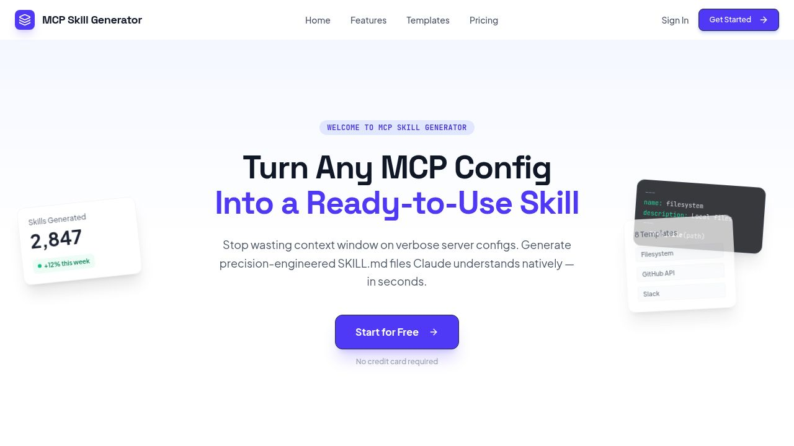

# MCP Skill Generator

> Turn any MCP server config into a compact, production-ready `SKILL.md` file — in seconds.



---

## What is it?

**MCP Skill Generator** is a full-stack developer tool that converts verbose MCP (Model Context Protocol) server configurations into precision-engineered `SKILL.md` files that Claude understands natively.

Stop wasting context window on raw configs. Generate structured skill files that are optimized, readable, and ready to drop into any Claude project.

---

## Features

| Feature | Description |
|---|---|
| ⚡ **AI Generator** | Paste an MCP config → get a polished `SKILL.md` in one click |
| 🧱 **Smart Builder** | Build a skill step-by-step with a guided wizard — **no AI key required** |
| 📚 **Template Library** | 20+ real skills from open-source GitHub repos (code review, CI/CD, SQL, security…) |
| 📄 **Template Detail Pages** | Full markdown preview, metadata, copy/use buttons for each template |
| 💾 **My Skills** | Save, search and manage all your generated skills |
| 🔔 **Notifications** | In-app alerts for every save, load, and generation action |
| 🌗 **Dark / Light mode** | Automatic theme sync including Clerk auth pages |
| 🔐 **Auth** | Clerk authentication — Google login or email |

---

## Stack

```
Frontend      React 19 + Vite + Tailwind CSS v4 + Wouter
Backend       Express + Drizzle ORM + PostgreSQL
Auth          Clerk (Replit-managed)
AI            OpenAI (client-side, your own key)
Deploy        Vercel (frontend static + API serverless)
Monorepo      pnpm workspaces
```

---

## Getting Started

### 1. Clone & install

```bash
git clone https://github.com/hassan312-god/sturdy-tribble.git
cd sturdy-tribble
pnpm install
```

### 2. Environment variables

Create a `.env` file at the root (or set via Replit Secrets):

```env
DATABASE_URL=postgresql://...
CLERK_PUBLISHABLE_KEY=pk_test_...
CLERK_SECRET_KEY=sk_test_...
VITE_CLERK_PUBLISHABLE_KEY=pk_test_...
SESSION_SECRET=your-random-secret
PORT=3000
BASE_PATH=/
```

### 3. Push database schema

```bash
pnpm --filter @workspace/db run push
```

### 4. Seed real skills from GitHub

```bash
pnpm --filter @workspace/scripts run seed-skills
```

This fetches 20 real `SKILL.md` files from open-source repos and inserts them as templates.

### 5. Run

```bash
# Frontend (Vite dev server)
pnpm --filter @workspace/mcp-skill-generator run dev

# API server
pnpm --filter @workspace/api-server run dev
```

---

## Routes

| Path | Page | Auth |
|---|---|---|
| `/` | Landing page | Public |
| `/sign-in` | Clerk sign-in | Public |
| `/sign-up` | Clerk sign-up | Public |
| `/dashboard` | Overview — stats, recent skills, quick actions | ✓ |
| `/generate` | AI Generator — MCP config → SKILL.md | ✓ |
| `/build` | Smart Builder — wizard, no AI needed | ✓ |
| `/templates` | Template library (20+ real skills) | ✓ |
| `/templates/:id` | Template detail — full preview + use | ✓ |
| `/my-skills` | Saved skills management | ✓ |
| `/settings` | Profile, API key, theme | ✓ |

---

## Template Sources

Real skills curated from these open-source repos:

- [`seb1n/awesome-ai-agent-skills`](https://github.com/seb1n/awesome-ai-agent-skills) — 19 production-quality skills
- [`intellectronica/awesome-skills`](https://github.com/intellectronica/awesome-skills) — community skill registry

Categories: **Code · Data · DevOps · Security · Database · Design · Research · Productivity · Marketing · Writing**

---

## Deploy to Vercel

See [`DEPLOY.md`](./DEPLOY.md) for the full guide.

**TL;DR:**

1. Import the repo on [vercel.com/new](https://vercel.com/new)
2. Set env vars: `DATABASE_URL`, `CLERK_PUBLISHABLE_KEY`, `CLERK_SECRET_KEY`, `VITE_CLERK_PUBLISHABLE_KEY`
3. Click **Deploy** — `vercel.json` handles routing (SPA + API serverless)
4. After first deploy: `DATABASE_URL="..." pnpm --filter @workspace/scripts run seed-skills`

---

## Project Structure

```
sturdy-tribble/
├── artifacts/
│   ├── mcp-skill-generator/   # React + Vite frontend
│   └── api-server/            # Express API server
├── lib/
│   ├── db/                    # Drizzle ORM + PostgreSQL schema
│   ├── api-spec/              # OpenAPI spec
│   ├── api-client-react/      # Generated React Query hooks
│   └── api-zod/               # Generated Zod validators
├── scripts/
│   └── seed-real-skills.ts    # Seeds 20 real SKILL.md templates
├── api/
│   └── index.ts               # Vercel serverless entry point
├── vercel.json                # Vercel deployment config
└── DEPLOY.md                  # Full deployment guide
```

---

## Smart Builder — No AI Required

The **Smart Builder** (`/build`) generates `SKILL.md` files using a rule-based wizard — no OpenAI key needed:

1. **Basic Info** — name, description, category, author, version, license
2. **Tools** — list MCP tools with descriptions and usage examples
3. **Workflow** — define numbered steps the agent should follow
4. **Config** — env variables, output format, best practices, edge cases
5. **Preview** — live `SKILL.md` preview, copy / download / save

---

## License

MIT — see [LICENSE](./LICENSE) if present, otherwise free to use.
